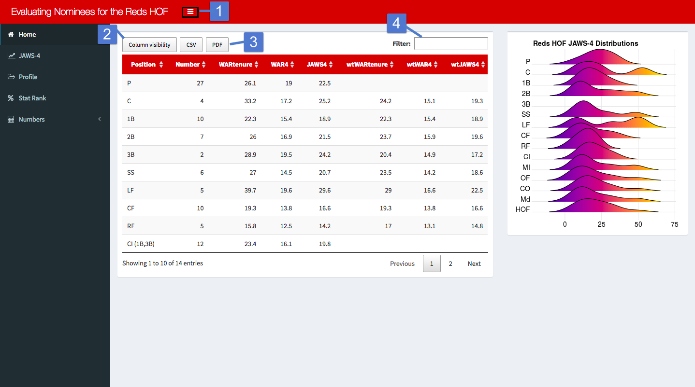
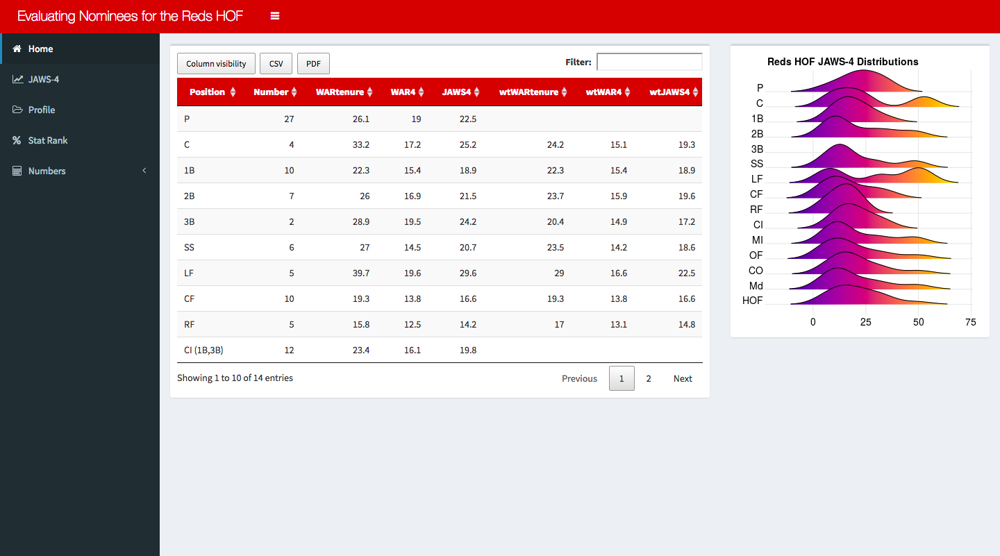
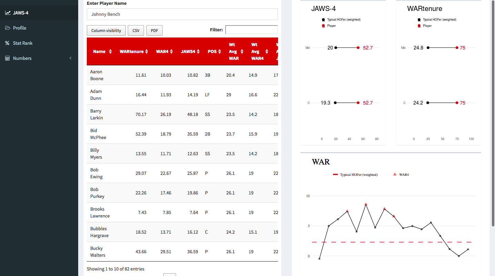
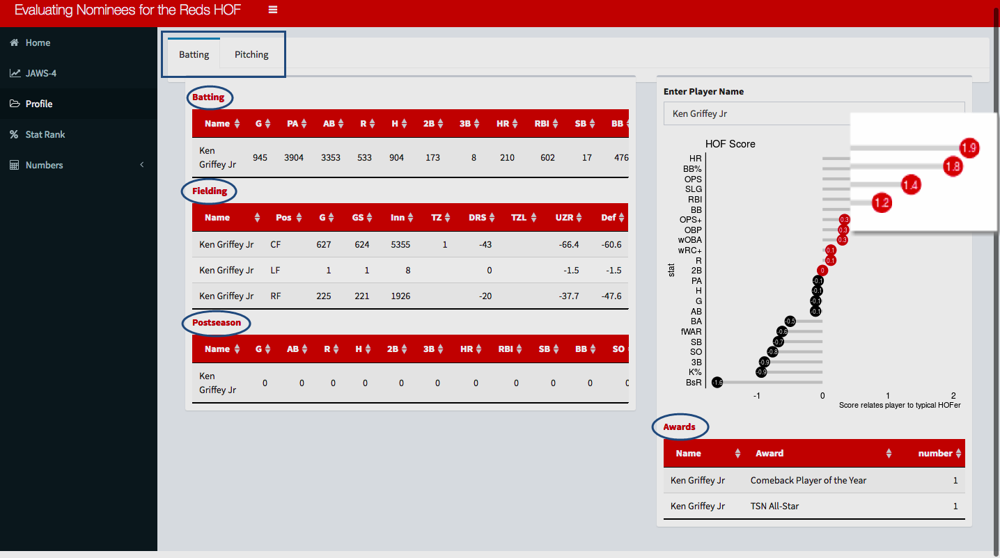
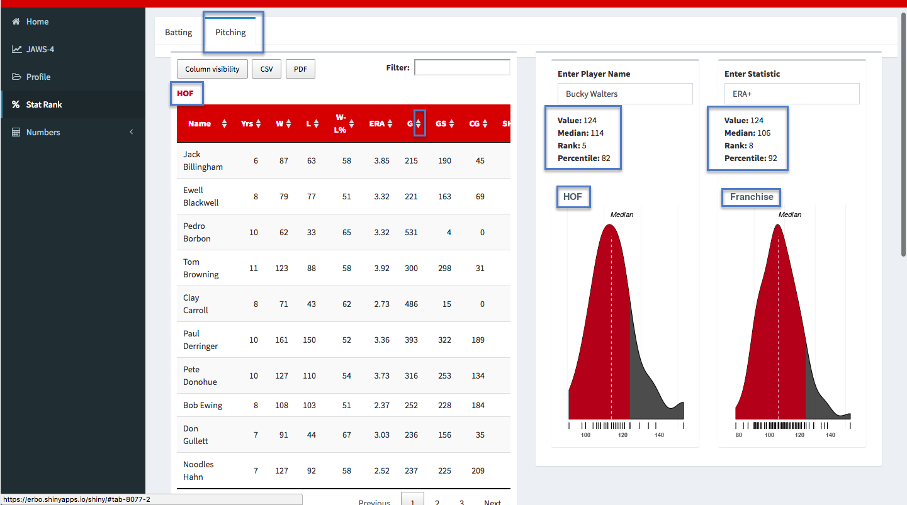
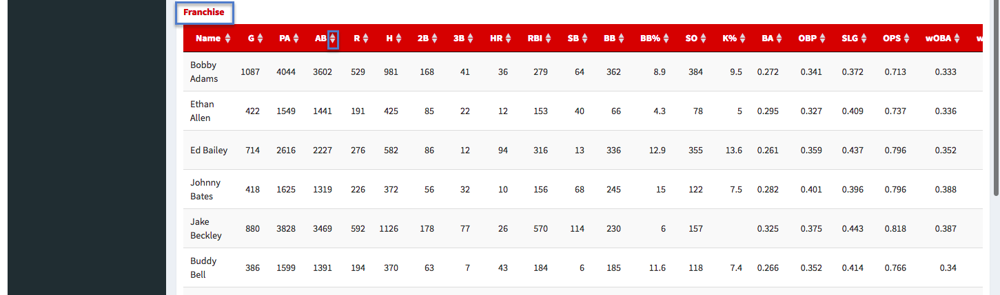
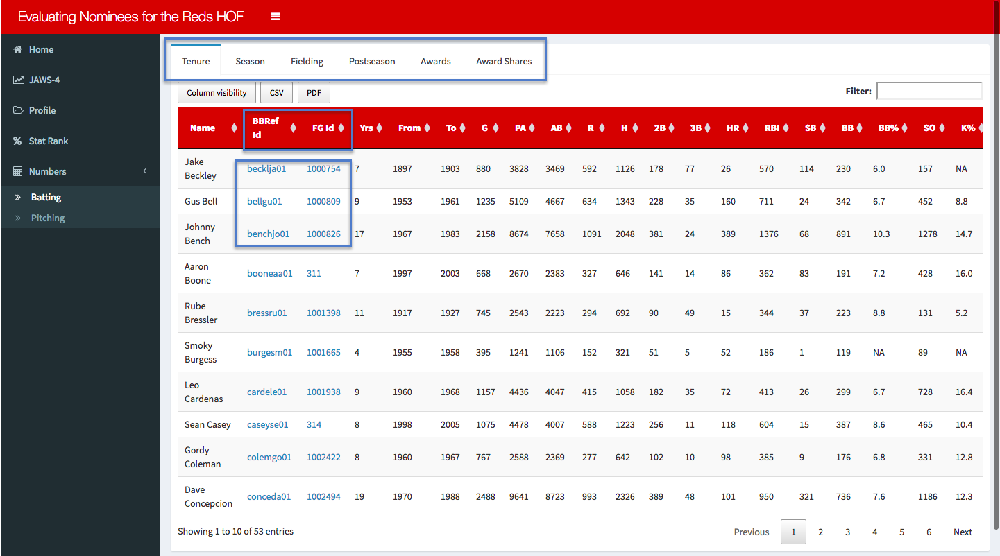

### Controls

For those unfamilar with shinydashboard and DataTables, there are some basic functions you should be aware of.

1. The toggle button in the header collapses/displays the sidebar.
2. The column visibility button adds/removes columns from view.
3. The PDF and CSV buttons download the data from that table in .pdf and .csv format.
      i. PDF: If the rows are filtered, then only those rows will be present in the downloaded document. It includes only rows on page 1 of the table. The number of entries per page can be specified at the bottom left corner of many of the tables. Regardless of which columns are visible, all columns will be included up to a maximum of 19 columns.
      ii. CSV: Only difference from PDF is that there is no column limit. So every column is included regardless of the size of the table.
4. The filter window uses [regex](https://www.regular-expressions.info) to filter the table. Note: you cannot specify the column to which the search criteria is applied. Examples:
      i. bench|rose|Larkin returns rows that correspond to those players -- ben|bar|ros will also return those players (along with Ernie Lombardi).
      ii. 1B|LF selects all rows with positon equal to first base or left field but also returns Dolf Luque.
      ii. e\$ returns players whose names end in "e" like Bid McPhee but not Joe Morgan. b$ can also be used to select all rows with position equal to 1B, 2B, or 3B.
      iii. ^e returns players' names that begin with the letter "e" such as Eric Davis
      iv. ^\[ep] returns all players whose name begins with an "e" or a "p" but also returns every pitcher.
      v. Numbers may also be used. 3358 will return all rows with that string of numbers in that order.
      


## Features

### Home

This page shows the current JAWS median values and weighted median values for each group/position. The ridge plot visualizes the distributions for each group. Please see the links in the [introduction](#intro) for explanations of these values.



### JAWS-4

The text input allows the user to select a player. Then dot plots are rendered that show how that player's total WAR as a Red and his JAWS4 score compare with that of a typical Hall of Famer. The line chart shows the player's WAR for every year he was a Red. Hovering over each point displays its value. The horizontal dashed line is one of two values: the median WAR per season of pitchers or the median WAR per season of position players.



### Profile

Tables show various statistical categories while the deviation plot gives a calculated score that relates the player's statistics to a typical Hall of Famer. The score gives users an estimate of where the player has excelled and faltered which many bolster or hinder his case. It also provides the user with an idea of which statistics to examine further on the Stat Rank page.  

Rough Guide\:  

| Rating | Score |
|:------:|:-----:|
| Excellent | 2 |
| Good | 0.5 |
| Median | 0 |
| Poor | -0.5 |
| Awful | -2 |



### Stat Rank

Ranks and percentiles of player statistics for both the Hall of Fame and franchise history can be viewed on this page. There are also Hall of Fame and franchise tables so the user can see which players rank above and below the nominee.




### Numbers

Here the user can have all the stats in front of them and compare players. Also, clickable links to player pages at Baseball-Reference and FanGraphs are provided under the Id columns.



## Notes

* When entering player names and stats, entries are case sensitive.
* All tables contain both nominees and inducteees.
* To qualify for the JAWS-4 calculation the player must have been tenured with the Reds for at least 4 seasons.
* To qualify for other statistical tables players needed at least 1500 plate appearances or 500 innings.
* Known issues and inconsistencies are listed and discussed [here](https://github.com/nllspc/Sports-Analysis/blob/master/RedsJAWs/Notes.md#issues).
* Explanations about the decision-making and details involved in the calculations are [here](https://github.com/nllspc/Sports-Analysis/blob/master/RedsJAWs/Notes.md#calculations).

## Acknowledgements

### Data
Data for this project was gathered from [Baseball-Reference](https://www.baseball-reference.com), [FanGraphs](https://www.fangraphs.com), and [Sean Lahman's Baseball Database](http://lahman.r-forge.r-project.org/)

### Packages
* [broom]( http://github.com/tidyverse/broom)
* [DT]( https://rstudio.github.io/DT)
* [formattable]( https://github.com/renkun-ken/formattable)
* [ggiraph]( https://davidgohel.github.io/ggiraph)
* [ggpubr]( http://www.sthda.com/english/rpkgs/ggpubr)
* [ggridges]( https://github.com/clauswilke/ggridges)
* [Lahman]( http://r-forge.r-project.org/R/?group_id=1221)
* [knitr](https://yihui.name/knitr/)
* [openWARData](https://github.com/beanumber/openWARData)
* [plyr]( https://github.com/hadley/plyr)
* [rlang]( https://github.com/tidyverse/rlang)
* [rvest](https://github.com/hadley/rvest)
* [shiny]( http://shiny.rstudio.com)
* [shinycssloaders](https://github.com/lukehaas/css-loaders)
* [shinydashboard]( http://rstudio.github.io/shinydashboard/)
* [tidyverse](https://github.com/tidyverse/tidyverse)
* [viridis]( https://github.com/sjmgarnier/viridis)

### Support

Special Thanks to  


``` {r, out.width="100px", out.height="100px", echo=FALSE}


```


<a href="https://github.com/louisville-rstats">Louisville RStats</a>

